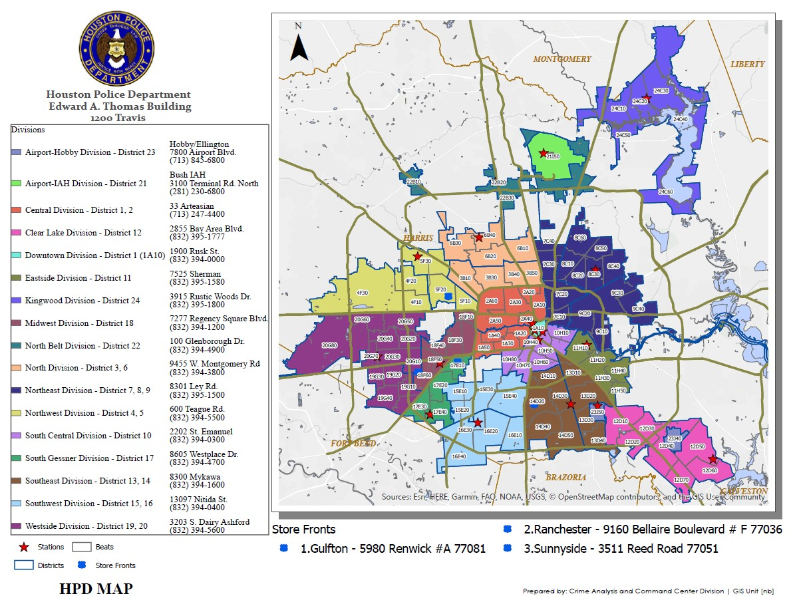

```{r setup, include=FALSE}
knitr::opts_chunk$set(echo = TRUE)
```




## importing the Data
the data is crime statistcis for the city of Houston 2022. the dataset is posted by the City of Houston official website and here is the link (https://www.houstontx.gov/police/cs/Monthly_Crime_Data_by_Street_and_Police_Beat.htm)

```{r}
#install.packages("readxl")
library(readxl)
library(tidyverse)
library(dplyr)

file_path <- "NIBRSPublicViewDec22.xlsx"

crime_stats <- read_excel(file_path)
glimpse(crime_stats)

```
##Data set
the data set contains 16 variables and 249912 rows


##Crime stats by zipcode


```{r}
summary(crime_stats$ZIPCode)


```

```{r}
library(ggplot2)

# Filter the data to include only ZIP codes between 77001 and 77036
filtered_data_1 <- crime_stats %>%
  filter(ZIPCode >= 77001, ZIPCode <= 77036)

# Create a count plot with rotated x-axis labels
ggplot(filtered_data_1, aes(x = as.factor(ZIPCode))) +
  geom_bar(fill = "lightblue", color = "black") +
  labs(
    title = "Distribution of Crime Incidents by ZIP Code",
    x = "ZIP Code",
    y = "Count"
  ) +
  theme_minimal() +
  theme(axis.text.x = element_text(angle = 90, hjust = 1))


```


```{r}

# Filter the data to include only ZIP codes between 77037 and 77071
filtered_data_2 <- crime_stats %>%
  filter(ZIPCode >= 77037, ZIPCode <= 77071)

# Create a count plot with rotated x-axis labels
ggplot(filtered_data_2, aes(x = as.factor(ZIPCode))) +
  geom_bar(fill = "lightblue", color = "black") +
  labs(
    title = "Distribution of Crime Incidents by ZIP Code",
    x = "ZIP Code",
    y = "Count"
  ) +
  theme_minimal() +
  theme(axis.text.x = element_text(angle = 90, hjust = 1))


```


```{r}
# Filter the data to include only ZIP codes between 77071 and 77099
filtered_data_3 <- crime_stats %>%
  filter(ZIPCode >= 77071, ZIPCode <= 77099)

# Create a count plot with rotated x-axis labels
ggplot(filtered_data_3, aes(x = as.factor(ZIPCode))) +
  geom_bar(fill = "lightblue", color = "black") +
  labs(
    title = "Distribution of Crime Incidents by ZIP Code",
    x = "ZIP Code",
    y = "Count"
  ) +
  theme_minimal() +
  theme(axis.text.x = element_text(angle = 90, hjust = 1))


```
##Crime descriptions in the dataset


```{r}
unique_crime_descriptions <- unique(crime_stats$NIBRSDescription)
unique_crime_descriptions

```
# Number of incidents per month


```{r}
# Convert 'RMSOccurrenceDate' to a date object
crime_stats$RMSOccurrenceDate <- as.Date(crime_stats$RMSOccurrenceDate)

# Extract month from 'RMSOccurrenceDate'
crime_stats$Month <- format(crime_stats$RMSOccurrenceDate, "%Y-%m")

# Create a bar graph for the number of incidents per month
ggplot(crime_stats, aes(x = Month, fill=Month)) +
  geom_bar() +
  labs(title = "Number of Incidents per Month",
       x = "Month",
       y = "Number of Incidents") +
  theme(axis.text.x = element_text(angle = 45, hjust = 1))


```


 The most committed crimes in the city of Houston

```{r}
crime_counts <- crime_stats %>%
  group_by(NIBRSDescription) %>%
  summarise(Count = n()) %>%
  arrange(desc(Count))

crime_counts %>% head(10)

```
The least crimes committed in the city of Houston

```{r}
crime_counts %>% tail(10)


```

what if I want to see the most committed crimes by zip code


```{r}
crime_counts_by_zip <- crime_stats %>%
  group_by(NIBRSDescription, ZIPCode) %>%
  summarise(Count = n()) %>%
  arrange(ZIPCode, desc(Count)) %>%
  group_by(ZIPCode) %>%
  slice_head(n = 1)

crime_counts_by_zip

```


What Beats have the highest incidents?

```{r}
beat_crime_counts <- crime_stats %>%
  group_by(Beat) %>%
  summarise(Count = n()) %>%
  arrange(desc(Count))

beat_crime_counts %>% head(10)
```
What Beats have the lowest incidents?

```{r}
beat_crime_counts %>% tail(10)

```
Incidents per district

```{r}
# Extract district information from the 'Beat' variable
crime_stats <- crime_stats %>%
  mutate(District = substr(Beat, 1, 2))

# Group by district and count the number of incidents
incidents_by_district <- crime_stats %>%
  group_by(District) %>%
  summarise(IncidentCount = n()) %>%
  arrange(desc(IncidentCount))

# Print the resulting data
print(incidents_by_district)

# Create a bar graph for the number of incidents per district
ggplot(incidents_by_district, aes(x = District, y = IncidentCount, fill = District)) +
  geom_bar(stat = "identity") +
  labs(title = "Number of Incidents per District",
       x = "District",
       y = "Number of Incidents") +
  theme(axis.text.x = element_text(angle = 45, hjust = 1))


```
Districts with highest incidents and districts with the lowest incidents 

```{r}
incidents_by_district %>% head(10)
incidents_by_district %>% tail(10)

```


## How many murders were committed in the year 2022

```{r}

murder_data <- crime_stats %>%
  filter(NIBRSDescription =="Murder, non-negligent")
murder_data

```

what zip code have the highest murder rate?

```{r}
highest_murder_count_zip <- murder_data %>%
  group_by(ZIPCode) %>%
  summarise(MurderCount = n()) %>%
  arrange(desc(MurderCount))

highest_murder_count_zip %>% head(10)


```
What zip code have the lowest murder rate?

```{r}
highest_murder_count_zip %>% tail(10)


```
murder rate per zip code

```{r}
filtered_data <- subset(murder_data, ZIPCode >= 77000 & ZIPCode <= 77036)

# Create a bar graph for murder counts by ZIPCode
ggplot(filtered_data, aes(x = as.factor(ZIPCode))) +
  geom_bar() +
  labs(title = "Murder Counts by ZIP Code",
       x = "ZIP Code",
       y = "Murder Count") +
  theme(axis.text.x = element_text(angle = 90, hjust = 1))
```

```{r}
filtered_data_1 <- subset(murder_data, ZIPCode >= 77037 & ZIPCode <= 77071)

# Create a bar graph for murder counts by ZIPCode
ggplot(filtered_data_1, aes(x = as.factor(ZIPCode))) +
  geom_bar() +
  labs(title = "Murder Counts by ZIP Code",
       x = "ZIP Code",
       y = "Murder Count") +
  theme(axis.text.x = element_text(angle = 90, hjust = 1))

```


```{r}
filtered_data_2 <- subset(murder_data, ZIPCode >= 77072 & ZIPCode <= 77099)

# Create a bar graph for murder counts by ZIPCode
ggplot(filtered_data_2, aes(x = as.factor(ZIPCode))) +
  geom_bar() +
  labs(title = "Murder Counts by ZIP Code",
       x = "ZIP Code",
       y = "Murder Count") +
  theme(axis.text.x = element_text(angle = 90, hjust = 1))


```
Murder Distribution by month
```{r}
# Convert 'RMSOccurrenceDate' to a date object
murder_data$RMSOccurrenceDate <- as.Date(murder_data$RMSOccurrenceDate)

# Extract month from 'RMSOccurrenceDate'
murder_data$Month <- format(murder_data$RMSOccurrenceDate, "%Y-%m")

# Create a bar graph for murder counts per month
ggplot(murder_data, aes(x = Month, fill=Month)) +
  geom_bar() +
  labs(title = "Distribution of Murders per Month",
       x = "Month",
       y = "Murder Count") +
  theme(axis.text.x = element_text(angle = 45, hjust = 1))


```
Murder rate per district

```{r}
# Create a subset for murder incidents
murder_data <- crime_stats %>% filter(NIBRSDescription == "Murder, non-negligent")

# Extract district information from the 'Beat' variable
murder_data <- murder_data %>%
  mutate(District = substr(Beat, 1, 2))

# Group by district and count the number of incidents
murder_by_district <- murder_data %>%
  group_by(District) %>%
  summarise(IncidentCount = n()) %>%
  arrange(desc(IncidentCount))

# Print the resulting data
print(murder_by_district)


```
Plot Murder rate per district

```{r}
ggplot(murder_by_district, aes(x = District, y = IncidentCount, fill = District)) +
  geom_bar(stat = "identity") +
  labs(title = "Number of Murders Incidents per District",
       x = "District",
       y = "Number of Murder Incidents") +
  theme(axis.text.x = element_text(angle = 45, hjust = 1))

```


 How many robberies were committed?

```{r}
robbery_data<-crime_stats %>% filter(NIBRSDescription=="Robbery")
robbery_data


```
Zip Code with highest robberies

```{r}
robbery_by_zip <- robbery_data %>%
  group_by(ZIPCode) %>%
  summarise(IncidentCount = n()) %>%
  arrange(desc(IncidentCount))
robbery_by_zip %>% head(10)

```
Zip Code with the lowest robberies

```{r}

robbery_by_zip %>% tail(10)

```
Robberies by Beat

```{r}
robbery_by_beat <- robbery_data %>%
  group_by(Beat) %>%
  summarise(IncidentCount = n()) %>%
  arrange(desc(IncidentCount))
robbery_by_beat

```
Beats with the highest robberies

```{r}
robbery_by_beat %>% head(10)

```
Beats with lowest robberies

```{r}
robbery_by_beat %>% tail(10)


```
Robberies per month 

```{r}
# Convert 'RMSOccurrenceDate' to a date object
robbery_data$RMSOccurrenceDate <- as.Date(robbery_data$RMSOccurrenceDate)

# Extract month from 'RMSOccurrenceDate'
robbery_data$Month <- format(robbery_data$RMSOccurrenceDate, "%Y-%m")

# Create a bar graph for the number of robberies per month
ggplot(robbery_data, aes(x = Month, fill=Month)) +
  geom_bar() +
  labs(title = "Number of Robberies per Month",
       x = "Month",
       y = "Number of Robberies") +
  theme(axis.text.x = element_text(angle = 45, hjust = 1))


```
Robberies per district

```{r}
# Extract district information from the 'Beat' variable
robbery_data <- robbery_data %>%
  mutate(District = substr(Beat, 1, 2))

# Group by district and count the number of incidents
robbery_by_district <- robbery_data %>%
  group_by(District) %>%
  summarise(IncidentCount = n()) %>%
  arrange(desc(IncidentCount))

# Print the resulting data
print(robbery_by_district)

```
Robberies by district

```{r}
robbery_by_district %>% head(10)
robbery_by_district %>% tail(10)

```


Plot robberies by district

```{r}

ggplot(robbery_by_district, aes(x = District, y = IncidentCount, fill = District)) +
  geom_bar(stat = "identity") +
  labs(title = "Number of Robberies per District",
       x = "District",
       y = "Number of Robberies") +
  theme(axis.text.x = element_text(angle = 45, hjust = 1))


```

incidents by premise

```{r}
# Group by premise and count the number of incidents
incidents_by_premise <- crime_stats %>%
  group_by(Premise) %>%
  summarise(IncidentCount = n()) %>%
  arrange(desc(IncidentCount))

# Print the resulting data
print(incidents_by_premise)

```


Crime incident per hour of the day

```{r}

# Group by the hour of the day and count the number of incidents
incidents_by_hour <- crime_stats %>%
  group_by(RMSOccurrenceHour) %>%
  summarise(IncidentCount = n()) %>%
  arrange(RMSOccurrenceHour)

# Print the resulting data
print(incidents_by_hour)

# Create a bar graph for the number of incidents by the hour of the day
ggplot(incidents_by_hour, aes(x = RMSOccurrenceHour, y = IncidentCount, fill = factor(RMSOccurrenceHour))) +
  geom_bar(stat = "identity") +
  labs(title = "Number of Incidents by Hour of the Day",
       x = "Hour of the Day",
       y = "Number of Incidents") +
  theme(axis.text.x = element_text(angle = 0))

```

Heat map by district 

```{r}
# Extract district information from the 'Beat' variable
crime_stats <- crime_stats %>%
  mutate(District = substr(Beat, 1, 2))

# Group by district and hour, count the number of incidents
incidents_by_district_hour <- crime_stats %>%
  group_by(District, RMSOccurrenceHour) %>%
  summarise(IncidentCount = n())

# Create a heatmap
ggplot(incidents_by_district_hour, aes(x = RMSOccurrenceHour, y = District, fill = IncidentCount)) +
  geom_tile() +
  labs(title = "Crime Incidents Heatmap by District",
       x = "Hour of the Day",
       y = "District",
       fill = "Number of Incidents") +
  scale_fill_gradient(low = "green", high = "red") +  # You can adjust colors as needed
  theme_minimal()

```

